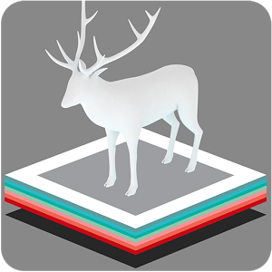
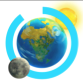
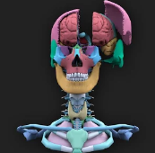

## APP´s de Realidad Aumentada

### 2\. Ed. Primaria

En esta etapa destacamos algunas de las aplicaciones más interesantes que a nivel educativo tienen mayor aceptación en las aulas.

 **[Arloon Plants](http://www.arloon.com/)**: Esta app de pago nos presenta un estudio completo sobre las platas y sus ciclos. Conceptos teóricos, actividades e interactividad se unifican en cada una de las aplicaciones de carácter científico que nos ofrecen. Está disponible en varias plataformas.

  

 **[ZooKazam](http://www.zookazam.com/)**: Esta app nos permite conocer el ecosistema o alimentación de una gran cantidad de animales. Por otro lado, y gracias a la tecnología de la RA, esta app nos proporciona una interactividad con el escenario presentado única en su categoría. Está disponible en varias plataformas.

 **[Arloon Solar System](http://www.arloon.com/)**: Esta app de pago nos presenta un estudio completo sobre el Sistema Solar y objetos estelares. Conceptos teóricos, actividades e interactividad se unifican en cada una de las aplicaciones de carácter científico que nos ofrecen. Está disponible en varias plataformas.  

 **[The Brain app](http://harmony.co.uk/project/the-brain-in-3d/)**: Gracias a esta app podemos hacer un estudio detallado de nuestro sistema nervioso, analizar las partes de nuestro cerebro o ver como es el funcionamiento y morfología de las neuronas. Descarga el marcador en su web y verás el sorprendente resultado. Disponible para **[IOS](https://itunes.apple.com/es/app/the-brain-ar-app/id680599952?ls=1&mt=8)** y **[ANDROID](https://play.google.com/store/apps/details?id=uk.co.harmony.brainapp)**.