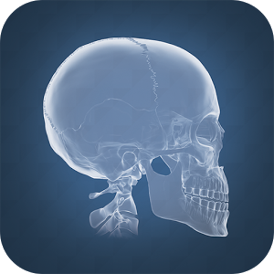
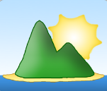

## APP´s de Realidad Aumentada

### 3\. Ed. Secundaria-Bachillerato

En este capítulo abordaremos algunas de las aplicaciones que para el nivel de Educación Secundaria y Bachillerato podemos encontrar.

****

**[Elements 4D](http://elements4d.daqri.com/)**: Aplicación con la que podremos hacer un completo estudio de los diferentes elementos de la tabla periódica. Nos proporciona numerosa información sobre ellos y nos permite la posibilidad de realizar reacciones químicas. Está disponible en varias plataformas.

  

**[Anatomy 4D](http://anatomy4d.daqri.com/)**: El estudio del cuerpo humano así como uno de los órganos más importantes, el corazón, es lo que nos muestra esta completa herramienta. Utilizando el marcador y las diferentes opciones de visionado, Anatomy 4D, es un gran recurso para el estudio en asignaturas tales como biología. Está disponible en varias plataformas.

  

**[Plickers](https://www.plickers.com/)**: Esta plataforma nos permite gestionar información en forma de preguntas distribuidas por clases. Cada uno de los integrantes tendrá asociado un marcador. Dicho marcador se utilizará para responder a cada pregunta múltiple que se muestre. La app está disponible en varias plataformas.

**[Augment](http://www.augment.com/es/)**: Crear nuestro propio material basado en la RA, cada vez es más sencillo. Esta app nos permite realizar estos procesos sin necesidad de realizar programaciones. Posee un gran repositorio de contenidos para ser utilizados. Está disponible en varias plataformas.

  

**[SketchAR](http://sketchar.tech/)**: Aprender a dibujar como un profesional no ha estado tan cerca como ahora. Gracias a esta app, podremos dibujar cualquier objeto gracias a su ayudante. Este nos guiará sobre el papel para obtener el mejor resultado. Esta app está disponible en varias plataformas.

  

**LandscapAR**: Trabajar con líneas de nivel en Geografía simplemente usando un papel es ahora posible gracias a esta app. Construir lagos, penínsulas o montañas son algunas de las posibilidades de esta app. De momento solo está disponible para [**ANDROID**](https://play.google.com/store/apps/details?id=de.berlin.reality.augmented.landscapar&hl=es).

  

**[AR Circuits](http://arcircuits.com/)**: App de pago que nos permite la construcción de circuitos gracias a sus [marcadores](https://moodle.catedu.es/mod/url/view.php?id=2996 "Marcadores"). Dispone de una versión web en la que podremos hacer las pruebas necesarias en la construcción de circuitos antes de iniciar el uso de la RA. Está disponible en varias plataformas.