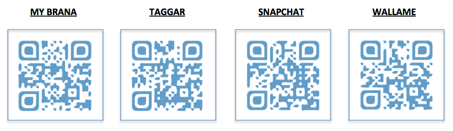

## APP´s de Realidad Aumentada

### 5\. RRSS basadas en RA

En este capítulo veremos algunas de las redes sociales que utilizan la realidad aumentada como reclamo para su innovador uso.

  

*   **[MyBrana](http://www.mybrana.com/)**: Puedes tomar imágenes y usar sus máscaras para personalizarlas.
*   **[Taggar](http://www.taggarapp.com/)**: Red social en la que podrás compartir tus vídeos o imágenes con otros usuarios.
*   **[Snapchat](https://www.snapchat.com/l/es/)**: Puedes enviar imágenes o vídeo cortos a tus contactos y que los puedan observar durante un tiempo limitado, personalizando el contenido con máscaras de RA.
*   **[Wallame](http://walla.me/)**: Deja mensajes ocultos a otros usuarios de la red, para que puedan escanearlos gracias al desarrollo de la realidad aumentada geolocalizada.

En la actualidad FACEBOOK se ha unido al uso de esta tecnología en la creación de fotografías.