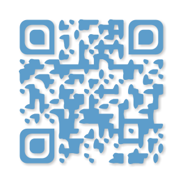
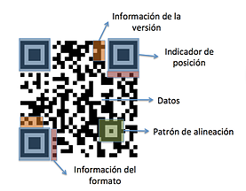
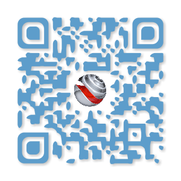

## Conceptos básicos

### 2\. Nivel 0

Este nivel de realidad aumentada corresponde a los activadores en blanco y negro como por ejemplo los códigos QR (Quick Response Code). Este tipo de [marcadores](https://moodle.catedu.es/mod/url/view.php?id=2996 "Marcadores") nos permiten crear hiperenlaces a contenidos albergados en una web. También permite asociar dicho código a diversos elementos tales como texto, posición GPS, enviar un SMS o dar la clave de una red WiFi.

Como podemos ver, no representa rigurosamente a una información digital presente en un entorno real, ya que el proceso en todo momento no se sale de una interacción totalmente digital. Mucho autores estiman que no se puede considerar con RA a este tipo de activadores, pero son realmente los precursores del inicio del uso de la RA.

En la siguiente imagen, vemos los diversos elementos que posee un código QR:

Una de las características más destacable de este tipo [marcadores](https://moodle.catedu.es/mod/url/view.php?id=2996 "Marcadores") es la posibilidad de customización. Esta personalización es posible gracias a que pueden perder un elevado porcentaje de información de imagen sin perder el contenido intrínseco del mensaje. Con esto, permite incluir un logo dentro del código o incluso modificar la forma de este.

