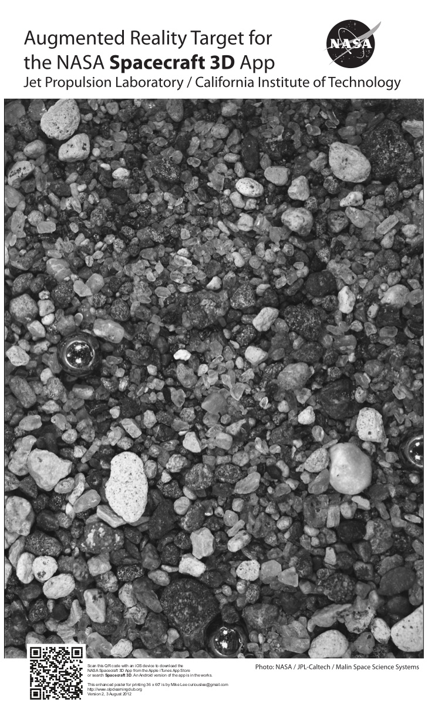

## Conceptos básicos

### 3\. Nivel 1

Este nivel, corresponde al uso de [marcadores](https://moodle.catedu.es/mod/url/view.php?id=2996 "Marcadores") que nos permiten ver una imagen, un elemento multimedia o incluso un objeto 3D. 

 

En este caso, es necesario que los activadores posean una serie de características que permitan al software o aplicación un correcta lectura:

* Colores y figuras nítidas
* Superficie del marcador poco reflectante 
* Bien iluminada en el momento de la lectura

En el siguiente vídeo podemos ver un ejemplo de este nivel de RA:

https://youtu.be/8RIlaUmK8pE