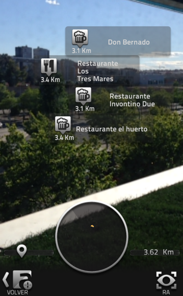

## Conceptos básicos

### 5\. Nivel 3

Este nivel corresponde a la llamada Realidad Aumentada Geolocalizada. El proceso de evolución del hardware en los dispositivos móviles está permitiendo la incorporación de nuevos elementos como los dispositivos GPS. Con ellos, podemos geolocalizar la posición del dispositivo con el fin de acceder a información específica del lugar.   

  

Esta información aparece en la pantalla de nuestro dispositivo como una realidad mixta en la que los contenidos son exclusivos del lugar geográfico. El proceso de acceso a esta información es gracias a que el software usado detecta nuestra posición, siendo esta el activador necesario. 

En el siguiente vídeo podemos ver un ejemplo de uso de este nivel de RA:

https://youtu.be/_AINcaYpeyg 