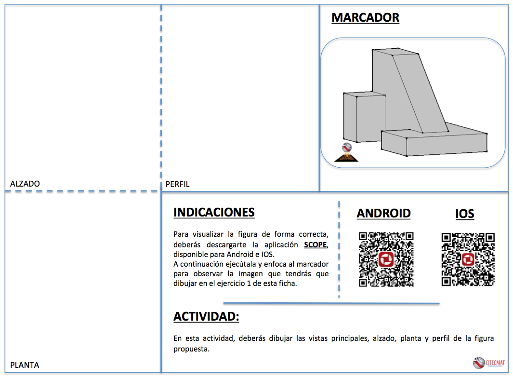
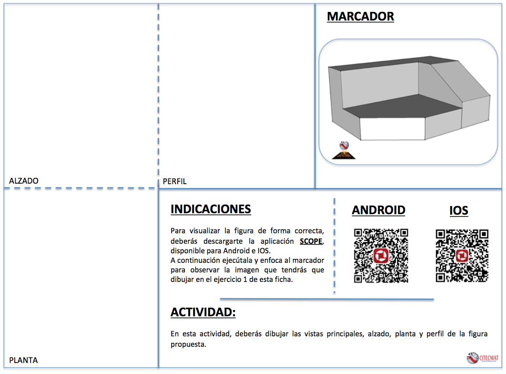
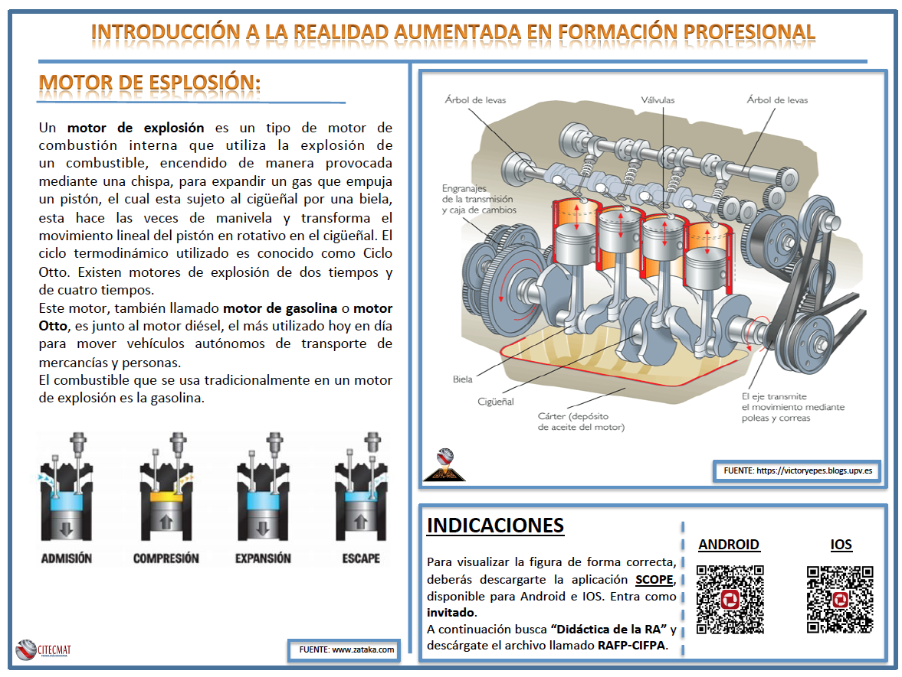

##  Ejemplos didácticos

### 3. Uso de Creator

A continuación mostramos el uso del software CREATOR y su app para dispositivos móviles SCOPE.

**PROPUESTA 1**:

En esta propuesta en forma de ficha interactiva se muestra el uso de **CREATOR** en dibujo técnico. En este [**enlace**](https://moodle.catedu.es/pluginfile.php/68432/mod_book/chapter/453/Fichas de Dibujo Tecnico.pdf) puedes descargarte las fichas de dibujo técnico. Para ver la propuesta debes buscar en la app SCOPE el proyecto "**Dibujo técnico**".

**PROPUESTA 2**:

En esta propuesta se muestra un conjunto de ejemplos del uso de CREATOR en el ámbito educativo. En este [**enlace**](https://moodle.catedu.es/pluginfile.php/68432/mod_book/chapter/453/Fichas RA para FP.pdf) podrás descargarte las fichas correspondientes a esta propuesta. Para ver la propuesta debes buscar en la app SCOPE el proyecto "**Didáctica de la RA**".

