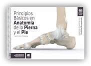

## Libros de Realidad Aumentada

### 3\. Educación Superior

**SINOPSIS**:  

Permite visualizar los objetos que están descritos en el libro en 3D, integrando los ejercicios del libro con Realidad Aumentada. Ayuda a los futuros ingenieros a aprender el lenguaje de los gráficos de ingeniería. Enfocado a habilidades de visualización y dibujo a mano.  

Editorial: **[SDC](https://www.sdcpublications.com/Textbooks/Visualization-Engineering-Design-Graphics-Augmented/ISBN/978-1-58503-817-6/)**

---

**SINOPSIS**:  

Este libro busca darle importancia al aprendizaje autónomo por parte de los lectores. Estos podrán explorar el hueso, músculo, tendón desde todas sus perspectivas posibles, así como aprender mucho mejor cuál es su función y su movimiento.

Editorial: **[AR-Books](http://www.ar-books.com/interior.php?contenido=libro.php&id=5)**

---

**SINOPSIS**:

En esta edición podemos encontrar temas como:

Las instalaciones eléctricas interiores. Circuitos y magnitudes eléctricas. Medidas de magnitudes y conexiones de circuitos. Componentes de las instalaciones eléctricas básicas. El montaje de instalaciones. Dispositivos para el alumbrado. Protección de las instalaciones eléctricas interiores.

Las instalaciones eléctricas en las edificaciones. Cálculo de líneas.Instalaciones interiores de viviendas.

Editorial: **[ALTAMAR](https://www.casadellibro.com/libro-instalaciones-electricas-interiores/9788416415731/5499584)**

---

**SINOPSIS**:

En esta edición podemos encontrar temas como:

Electrotecnia, [conceptos básicos](https://moodle.catedu.es/mod/book/view.php?id=994 "Conceptos básicos"). Componentes del circuito eléctrico. Circuitos de corriente continua. Electromagnetismo. Circuitos de corriente alterna monofásica. Circuitos de corriente trifásica. Transformadores. Máquinas rotativas.  

Editorial: **[ALTAMAR](https://www.casadellibro.com/libro-electrotecnia-grado-medio-ciclos-formativos/9788416415755/5803351)**

---

**SINOPSIS**:

En esta edición podemos encontrar temas como:

Instalaciones de automatismos industriales.  
Cuadros eléctricos para instalaciones eléctricas industriales.
Operaciones de mecanizado en cuadros y canalizaciones.
Dispositivos básicos de los automatismos industriales cableados.  
Montaje y control de instalaciones con motores.  
Autómatas programables. Programación de autómatas programables.  
  

Editorial: **[ALTAMAR](https://www.casadellibro.com/libro-automatismos-industriales-realidad-aumentada/9788416415748/5563103?gclid=cj0kcqiasjfhbrcaarisao68zm73fk1c3jbxjkj0zqjjhmwhu-m3poajve1edgykaldkm6q0l_hj1guaarsuealw_wcb&utm_source=google&utm_medium=cpc&utm_campaign=19438)**