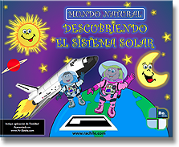

## Libros de Realidad Aumentada

### 4\. Libros de lectura

**SINOPSIS**:

Willy, Vegetta, Trotuman y Vakypandy los acompañarán en su viaje de vuelta a Capital Huesitos, donde han sido invitados a asistir a las Dinolimpiadas. Pero lo que en principio iba a ser un viaje de recreo terminará complicándose: un divertido secuestro, un pequeño personaje empeñado en aguarnos la fiesta, un volcán en erupción.  

Editorial: **[Martínez Roca](https://www.planetadelibros.com/libro-wigetta-en-las-dinolimpiadas/216985#soporte/216985)**

---

**SINOPSIS**:

Después del último ataque sufrido, los habitantes de Pueblo han recuperado la tranquilidad y su existencia transcurre en paz. Todo parece funcionar a la perfección. Sin embargo, una serie de misteriosas desapariciones van a alterar las cosas… Una amenaza externa, con forma muy peculiar; una criatura extraordinaria dotada de una poderosa arma.

Editorial: **[Martínez Roca](https://www.planetadelibros.com/libro-wigetta-y-el-baculo-dorado/200915#soporte/200915)**  

---

**SINOPSIS**:

Todo empieza cuando Lúpulus, hambriento, está a punto de comerse una suculenta oveja pero, de repente, su mandíbula queda atascada.

Editorial: **[Parramón](https://www.boolino.es/es/libros-cuentos/un-lobo-boquiabierto/)**

---

**SINOPSIS**:

En este libro les contaremos sobre cada planeta y sus principales características. Además de los viajes al espacio y la llegada del hombre a la Luna.  

Editorial: **[AR-Books](http://author.aumentaty.com/comunidad)**

---

**SINOPSIS**:  

Este libro propone una forma distinta de disfrutar la literatura juvenil, y lo hace con propuestas como Historia de Dani de la saga Odio el Rosa: este universo está formado por 6 libros, 22 páginas web transmedia y una aplicación de realidad aumentada. **Esta historia comienza en la ciudad de Los Ángeles en el año 2055**.  

Editorial: **[Oxford](http://www.odioelrosa.com/tag/oxford-university-press/)**

---

**SINOPSIS**:

Los tres libros de esta deliciosa y divertida serie nos cuentan la historia de amistad entre Alien y Cavernícola. El futuro se encuentra con el pasado cuando la nave espacial de Alien se queda sin energía y aterriza en la Edad de Piedra. Allí conocerá a Cavernícola, una persona totalmente distinta a él.

 Editorial: **[Edebe](http://tienda.edebe.com/catalog/product/view/id/6741/s/el-brontocerdo/)**

---

**SINOPSIS**:

Este libro forma parte de la colección Cuentos Animados, una colección de cuentos ilustrados con una aplicación gratuita de realidad aumentada. Los libros pueden leerse por separado o cobrar vida colocando una tablet o smartphone sobre sus páginas.  

Editorial: **[Kokinos](http://www.editorialkokinos.com/libro/valentina)**