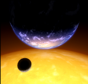
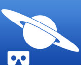
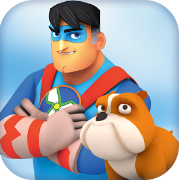
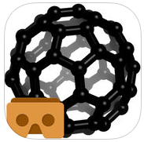

## App´s de Realidad Virtual

En este apartado realizaremos una pequeña muestra de algunas de las aplicaciones de realidad virtual destacables en el ámbito educativo. Si bien para obtener el mayor rendimiento es conveniente poseer gafas de RV, para observar estás app´s puedes prescindir de ellas.

****

  

**[Titans of Space VR](http://www.titansofspacevr.com/)**: Visita virtual por los planetas del Sistema Solar. El audio-guía nos contará las principales características de cada unos de los objetos estelares que vamos recorriendo. Dispone de 50 minutos de narración. Disponible en: **[ANDROID](https://play.google.com/store/apps/details?id=com.drashvr.titansofspacecb&hl=es)**

  
  
****  
**[Star Chart](https://www.facebook.com/StarChart)**: Planetario virtual con el que podremos conocer el sistema solar y el resto de objetos estelares. Disponible en: **[ANDROID](https://play.google.com/store/apps/details?id=com.escapistgames.starchartvr&hl=en_GB) **e[IOS](https://itunes.apple.com/gb/app/star-chart-vr/id1083945479?mt=8).  

  

  

](https://www.edf.fr/)**

****

**[Cleanopolis VR](https://www.edf.fr/)****:** Juego que muestra los efectos del cambio climático y enseña que es lo que debemos hacer para evitar las catástrofes que se generan. Disponible en: [ANDROID](https://play.google.com/store/apps/details?id=com.bulkypix.cleanopolis&hl=en_GB) e[IOS](https://itunes.apple.com/gb/app/cleanopolis-vr/id1045463085?mt=8)  
  
  

  
Carbons VR](http://educhem-vr.com/)**: App que nos permite conocer en profundidad las diversas características de elementos basados en el carbono, como por ejemplo los nanotubos. Disponible en: [**ANDROID**](https://play.google.com/store/apps/details?id=com.EduChem&hl=es) e [**IOS**](https://itunes.apple.com/mx/app/learning-carbons-vr/id1180338905?l=en&mt=8).

  
Spotlight Stories](https://atap.google.com/spotlight-stories/)**: Contar historias ahora es realmente atractivo. Esta app permite leer diversos cuentos en formato de 360 grados o mediante la realidad virtual. Disponible en: **[ANDROID](https://play.google.com/store/apps/details?id=com.google.android.spotlightstories&hl=en)** e [**IOS**](https://itunes.apple.com/us/app/google-spotlight-stories/id974739483?mt=8)  

  

  

En los siguientes enlaces podrás encontrar numerosas aplicaciones para dispositivos móviles:

*   **[Aplicaciones para sistemas ANDROID](https://play.google.com/store/search?q=VR&c=apps)**
*   **[Aplicaciones para sistemas IOS](https://www.vr-iphone.com/game-list/)**

