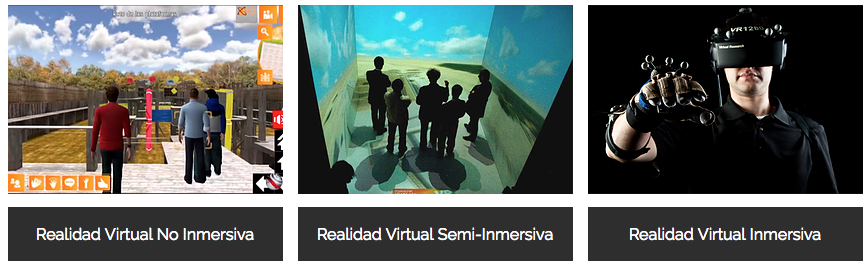

## Introducción a la Realidad Virtual

Podemos definir la realidad virtual como: " ….la realidad virtual sustituye la realidad física por un mundo virtual incorporación de datos e información digital en un entorno irreal, por medio un software,….". Fomentamos la interactividad siendo esta cada vez mayor cuantos más elementos sensoriales aportemos a la experiencia.

Existen varios tipos de realidad virtual, veamos cuales:

*   _**REALIDAD VIRTUAL NO INMERSIVA**_: Escenarios virtuales generados por ordenador, donde una pantalla es la ventana hacia el mundo virtual.
    

  

*   _**REALIDAD VIRTUAL SEMI-INMERSIVA**_: Escenarios virtuales son generados en 4 monitores que rodean al espectador.
    

  

*   _**REALIDAD VIRTUAL INMERSIVA**_: El acceso al mundo virtual se realiza a través de visores que proporcionan una interacción con los escenarios.
    

