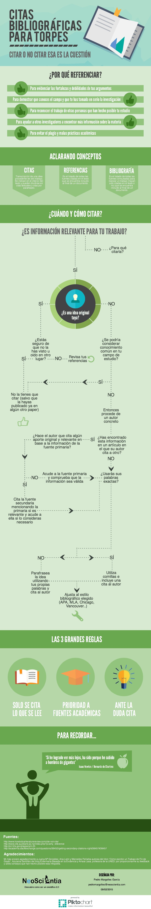

# Ojo con los textos

El **plagio en los textos** (copia y pega) no se puede utilizar [[+info](http://biblioteca.ua.es/es/propiedad-intelectual/aprende-sobre-el-plagio-y-como-evitarlo.html)], en estos casos es mejor poner un hipervínculo a la página de origen. Un párrafo o un extracto de **más de 11 palabras concatenadas** se puede considerar plagio.[+info](https://www.pinsentmasons.com/out-law/news/eleven-word-snippets-can-infringe-copyright-rules-ecj#:~:text=The%20copying%20and%20reproduction%20of,service's%20copying%20could%20be%20unlawful.)

Infografía: Citas bibliográficas para torpes https://www.neoscientia.com/citas-bibliograficas/

## Normativa para referenciar

Existen varias normativas a la hora de citar trabajos realizados por otros autores.  _**[APA](http://www.apa.org/)**_, _**[ISO 690](https://www.iso.org/home.html)**_ y _**[MLA](https://www.mla.org/)**_.  La más utilizada es la normativa APA. 

https://www.youtube.com/watch?v=4BmLN0t_Vwg&feature=emb_logo 

En el caso de no estar seguro de cómo realizar una referencia de este tipo, existen en la web diversas plataformas que facilitan este trabajo. Algunas de ellas son: [REFFOR](http://reffor.us/index.php) y [CALVIN](http://www.calvin.edu/library/knightcite/index.php)
    
Si necesitamos referencias imágenes que hemos recogido de otros portales o autores, el formato es el siguiente:

