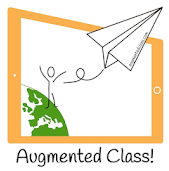

## Recursos

### 3\. Plataformas de Creación

En esta sección mostraremos algunos ejemplos de plataformas móviles que permiten la creación de realidad aumentada.

    

**Roar **es una plataforma permite crear aplicaciones de realidad aumentada que pueden ser utilizadas desde nuestro dispositivo móvil.

*   [**Web**](https://theroar.io/)
*   **[Canal de Youtube](https://www.youtube.com/channel/UCVmfOX80BAGaOFOmBmGSc2g/videos)**
*   **App ([IOS](https://itunes.apple.com/us/app/roar-augmented-reality-app/id1045561660?mt=8) - [ANDROID](https://play.google.com/store/apps/details?id=com.roar.scanner))**

**  
**

**Zapworks** es una plataforma nos permite crear experiencias basadas en realidad aumentada

*   **[Web](https://zap.works/)**
*   **[Canal de Youtube](https://www.youtube.com/user/zappartv)**
*   **App ([IOS](https://itunes.apple.com/gb/app/zappar/id429885268) - [ANDROID](https://play.google.com/store/apps/details?id=com.zappar.Zappar))**

**Augmented Class** es una plataforma desarrollada en España, permite crear contenidos en realidad aumentada de forma sencilla.

*   **[Web](http://www.augmentedclass.com/)**
*   **[Canal de Youtube](https://www.youtube.com/channel/UCNHh1DqRXXQ122Xw0b2OHrQ)**
*   **App ([ANDROID](https://play.google.com/store/apps/details?id=com.AugmentedClass.AClass))**

****

**Appy Pie** es una plataforma que permite crear [app´s de realidad aumentada](https://moodle.catedu.es/mod/book/view.php?id=992 "APP´s de Realidad Aumentada") de forma sencilla y rápida.

*   **[Web](https://es.appypie.com/)**
*   **[Canal de Youtube](https://www.youtube.com/channel/UCTCVmyEAfUNdNHL8R1rKIGQ) **

**  
  
Metaverse **es una plataforma que permite crear juegos, historias interactivas y multitud de experiencias basadas en realidad aumetada  
  

*   **[Web](https://gometa.io/)**
*   **[Canal de Youtube](https://www.youtube.com/channel/UCum7uPJBXug0HfqNi4AfQmQ)**
*   **App ([IOS](https://itunes.apple.com/es/app/metaverse-ar-browser/id1159155137?mt=8&ign-mpt=uo%3D4) )**

****

**CoSpaces** es una plataforma que permite crear juegos, ......  

*   **[Web](https://cospaces.io/edu/)**
*   **[Canal de Youtube](https://www.youtube.com/channel/UC6VsnmaKQ9MNRpJbFsIhoGw)**
*   **App ([IOS](https://itunes.apple.com/us/app/cospaces-edu/id1224622426?mt=8) - ****[ANDROID](https://play.google.com/store/apps/details?id=delightex.cospaces.edu&hl=es))**